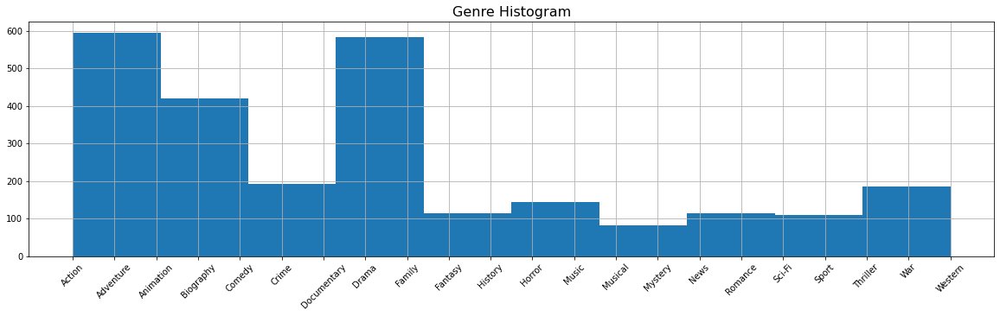
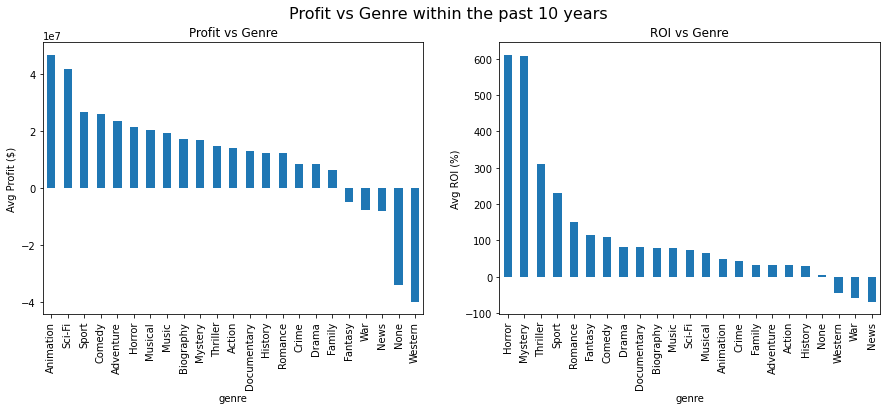
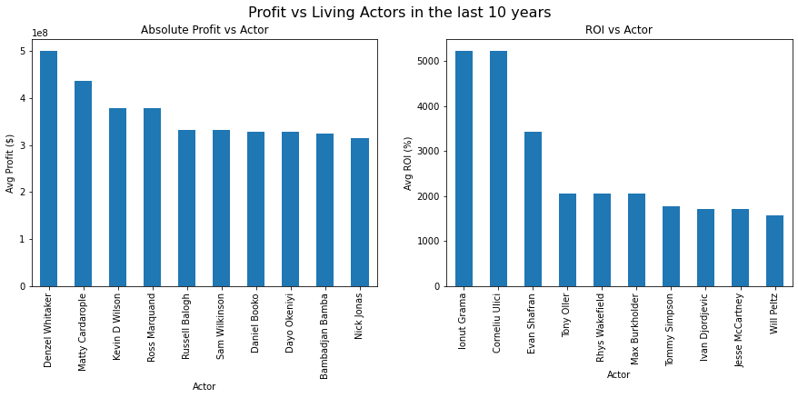
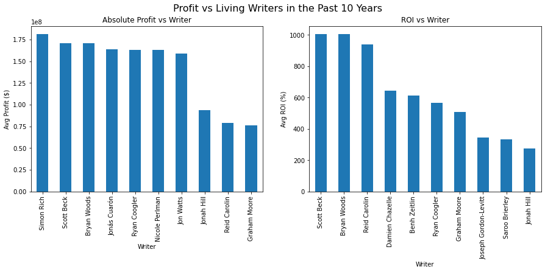

# Microsoft Movie Industry Recommendations

**Author**: Jasper Chen

## Overview

Microsoft wants to enter the movie industry.  It needs some recommendations to start.

## Business Problem

Find some the best genres, actors, and writers.

***
Questions to consider:
* What are the business's pain points related to this project?
* How did you pick the data analysis question(s) that you did?
* Why are these questions important from a business perspective?
***

## Data

Describe the data being used for this project.

***
Questions to consider:
* Where did the data come from, and how do they relate to the data analysis questions?
* What do the data represent? Who is in the sample and what variables are included?
* What is the target variable?
* What are the properties of the variables you intend to use?
***

## Methods

Describe the process for analyzing or modeling the data. For Phase 1, this will be descriptive analysis.

***
Questions to consider:
* How did you prepare, analyze or model the data?
* Why is this approach appropriate given the data and the business problem?
***

## Results

Present your key results. For Phase 1, this will be findings from your descriptive analysis.

***
Questions to consider:
* How do you interpret the results?
* How confident are you that your results would generalize beyond the data you have?
***

Here is an example of how to embed images from your sub-folder:

### Genre Histogram


## Conclusions

Within the past 10 years, there have been a lot of action and adventure movies.

### Profit vs Genre


### Genre Conclusion
The most profitable genres within the past 10 years

By absolute profit: Animation, Sci-fi

By ROI: Horror, Mystery

### Profit vs Actor


### Conclusion
The most profitable actors

Best absolute profit: Denzel Whitaker, Matty Cardarople

Best ROI: Ionut Grama, Corneliu Ulici
### Profit vs Writer


### Conclusion
The most profitable living movie writers within the past ten years

Simon Rich writes the best movies based on absolute profit.

Scott Beck writes the best movies based on ROI.
# Final Conclusion
Create a horror/mystery written by Scott Beck with actors Ionut Grama, Corneliu
Ulici.

***
Questions to consider:
* What would you recommend the business do as a result of this work?
* What are some reasons why your analysis might not fully solve the business problem?
* What else could you do in the future to improve this project?
***

## For More Information

Please review our full analysis in [our Jupyter Notebook](./project.ipynb) or our [presentation](./DS_Project_Presentation.pdf).

For any additional questions, please contact **Jasper Chen jasperschen@gmail.com**

## Repository Structure

Describe the structure of your repository and its contents, for example:

```
├── README.md                           <- The top-level README for reviewers of this project
├── dsc-phase1-project-template.ipynb   <- Narrative documentation of analysis in Jupyter notebook
├── Micrsoft Movie Proposal.pdf         <- PDF version of project presentation
├── src
│   ├── project.ipynb               <- .py script to create finalized versions of visuals for project
└── img                                 <- Both sourced externally and generated from code
```
